- [Investors Club](#investors-club)
  * [User Experience (UX)](#user-experience-ux)
    + [Site Owner Goals](#site-owner-goals)
    + [User Stories](#user-stories)
    + [Structure](#structure)
    + [Design](#design)
  * [Wireframes](#wireframes)
  * [Features](#features)
    + [Nav Bar](#nav-bar)
    + [Landing Page](#landing-page)
    + [About Section](#about-section)
    + [Why Join Section](#why-join-section)
    + [Footer](#footer)
    + [Events Page](#events-page)
    + [Contact Page](#contact-page)
    + [Features Left to Implement](#features-left-to-implement)
  * [Testing](#testing)
    + [Validator](#validator)
    + [Responsive Testing](#responsive-testing)
    + [Lighthouse Testing](#lighthouse-testing)
    + [Links and Form Testing](#links-and-form-testing)
    + [Fixed Bugs](#fixed-bugs)
    + [Known/Unfixed Bugs](#known-unfixed-bugs)
  * [Technologies Used](#technologies-used)
    + [Languages](#languages)
    + [Programs & Libraries](#programs---libraries)
  * [Deployment](#deployment)
  * [Credits](#credits)
    + [Code](#code)
    + [Content](#content)
    + [Media](#media)
    + [Acknowledgements](#acknowledgements)

<small><i><a href='http://ecotrust-canada.github.io/markdown-toc/'>Table of contents generated with markdown-toc</a></i></small>


# Investors Club

Investors Club is a website for a club where members are interested in finance and investing.
The website aims to get people interested in a vibrant community of investors from different points in life.
The website is fully responsive across all screen sizes and has been designed to be easily and intuitively navigated.

It is often the case that retail investors are alone, and have trouble finding people around them to engage with.
Investors Club can be a great tool for these people to find each other. 

The site includes a page for local events you can attend, as well as a sign-up/contact form to register for upcoming events or to submit questions.

[Find the live website here!](https://lucasbehrendt.github.io/investorsclub/)

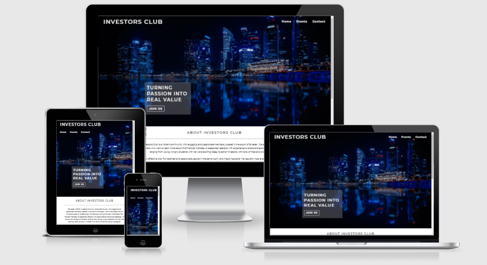

## User Experience (UX)
### Site Owner Goals

- Attract people interested in finance.
- Fill a need for socializing with likeminded peers.
- Provide a space from where physical meetings can be arranged.
- Give new potential members an easy way of contacting the club.

### User Stories
-	#### First Time User

    - Get familiar with the website and have a positive experience.
    - Briefly learn about the clubs purpose and history.
    - Navigate the website with ease and check out upcoming events.
    - Find the contact form easily and get an overall positive impression of the club.

-	#### Returning User

    - Easily find and visit the clubs social media accounts.
    - Browse upcoming events and find locations / dates that suit me.
    - Have the option of contacting the club with questions.

-	#### Frequent User

    - Sign up for upcoming events and get feedback that i am registered.
    - Be able to get more involved with the club through the contact form.
    - Be able to suggest new events and locations.

### Structure

The website is structured to be highly accessible, easily navigated and to keep a consistency in colouring and informational flow. The landing page structure is simple and intuitive, with an inviting layout and clear paths to follow. There are three pages to the site, which help keep the individual pages from being too cluttered or too long. The maximum required clicks to get to a specific part of the site is kept at three. 

- The sections on the Home page are structured to fit well together and have a natural transition. Some content hinting on the landing incentivizes the user to scroll further.

- A seperate Events page keeps the focus on finding events that the user is interested in, with a slimmed down structure and inviting cards for each listed event.

- A Contact page where the user can either sign up for an event or submit a question is also served on a seperate page to maintain a clean structure. The form provides feedback to let the user know it has been successfully submitted.

### Design
- #### Colours

  - The main colour scheme of the website is chosen to suit the financial theme and to work well together, while simultaneously provide good contrast. The main font colour is a dark slate gray (#333333) with an alternation of a white (#FFFFFF) and a whitesmoke (#EEEEEE) background. Where necessary, for example on the hero image, the font colour is changed to whitesmoke (#EEEEEE) for better contrast.

- #### Typography

  - The main fonts used is Montserrat semi-bold for h1 and h2, with Roboto regular for paragraphs and smaller headings. By researching suitable fonts for financial content, this pairing works very well together according to sites like [this](https://typ.io/fonts/roboto/with/montserrat). If for some reason the fonts aren't imported correctly, Sans serif will serve as fallback.

- #### Imagery

  -  The images used throughout the website are chosen to convey a mix of financial competency and a strong sense of community. A looping video of a rotating skyscraper on the contact page provides a visually alluring element. All images were chosen with care to provide not only pleasing content, but to work well with fonts and colours. 

## Wireframes

Wireframes were created using Balsamiq.

<details>

<summary>Desktop wireframes</summary>

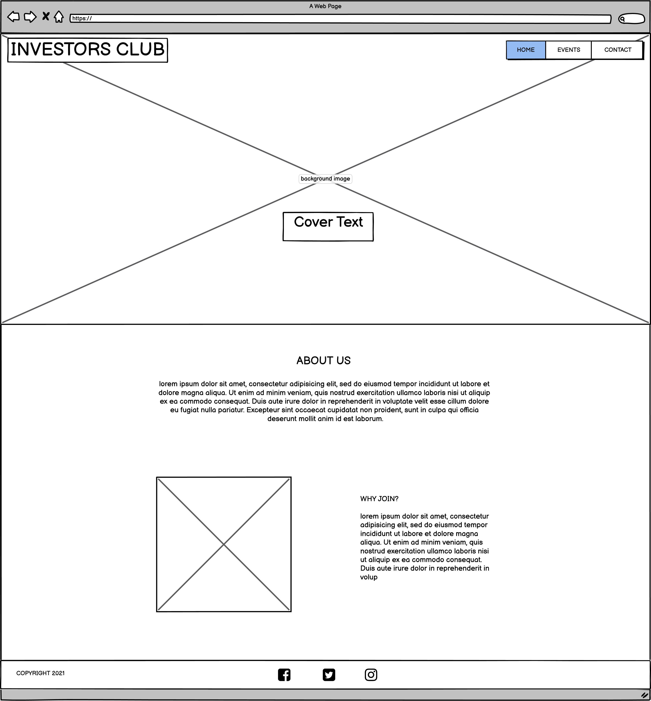
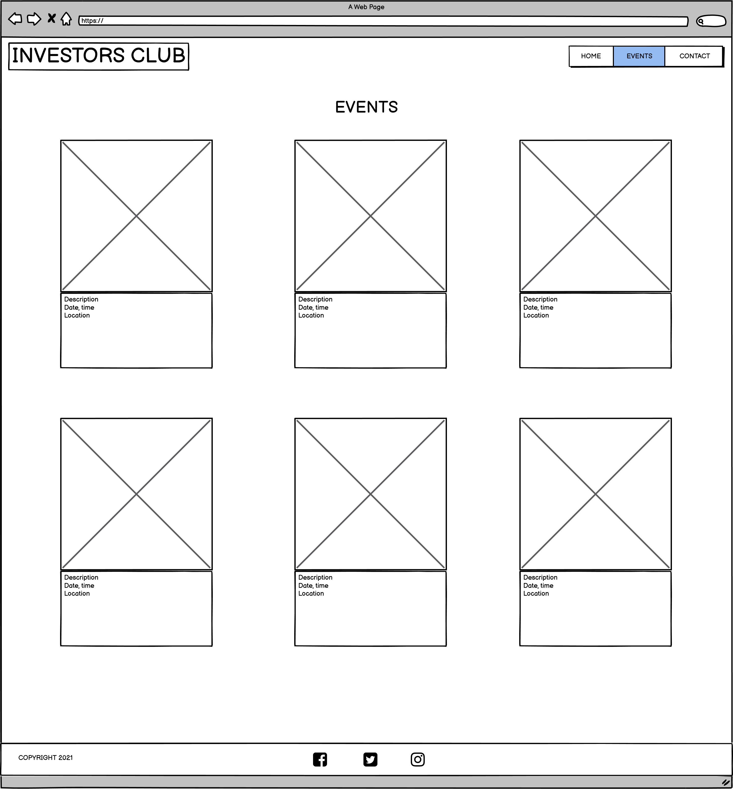
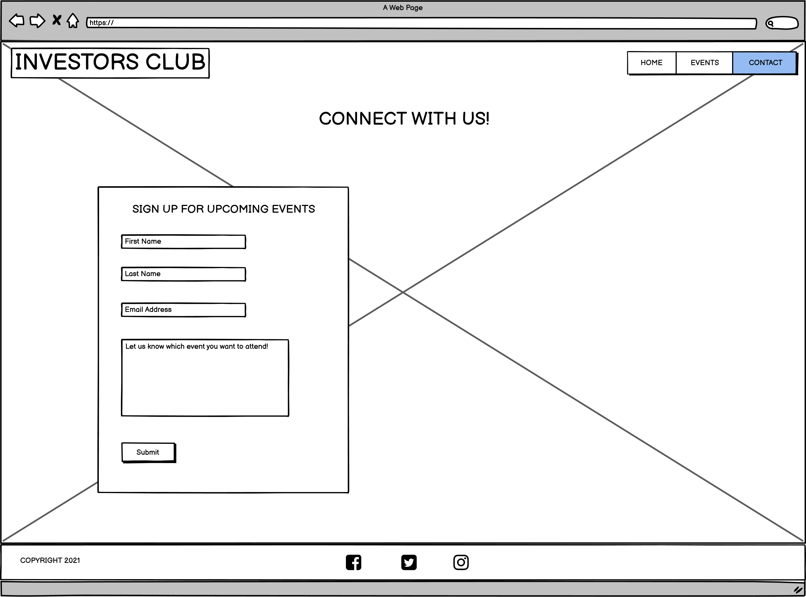

</details>

<details>

<summary>Mobile wireframes</summary>

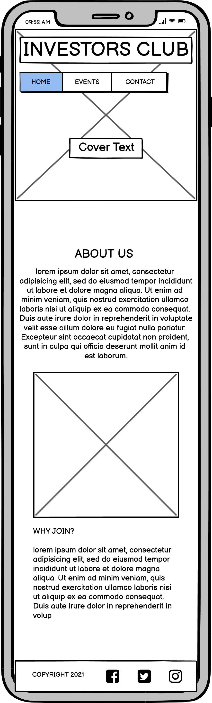
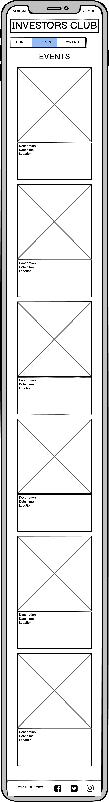
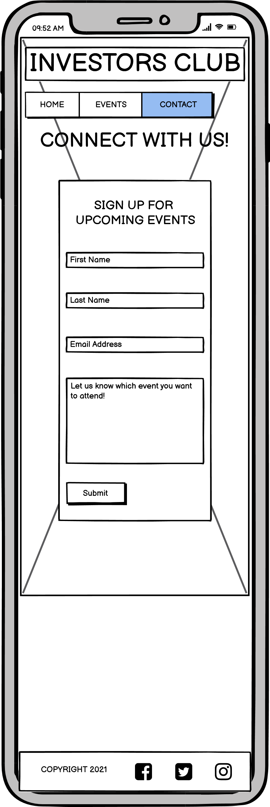

</details>

## Features

In the following section i will provide an overview of the features on Investors Club. The site consists of three pages, each with its unique purpose. Some features exists on all pages, while others are specific to a single page and its purpose.

### Nav Bar

- Featured at the very top of all three pages is a navigation bar, which holds the logo for the site on the left hand side, as well as navigation links on the right hand side, 'Home', 'Events' and 'Contact'. These links help the user to easily and intuitively navigate the website, and when hovered over they display a line below the link to further assist in navigation. The logo also serves as a link to the home page, as expected by industry standards. The nav bar overlays a dark image, and the font colour is therefore whitesmoke (#EEEEEE).

- For full responsiveness the links will drop down underneath the logo on smaller screen sizes for a more clean and breathing look. The font size will also adapt as screen size is reduced to help give a better and more balanced look.

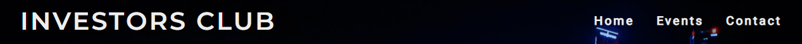

### Landing Page

- The landing page consists of a visually striking and inviting image with a strong sense of a finacial theme. It also includes text overlay with an easy-to-remeber slogan that emphasise the purpose of the club, and a 'Join us' button that links to the contact page. The overlay has a grey background cosistent with the sites colour scheme of dark slate gray (#333333). Just as in the nav bar, the font colour is whitesmoke (#EEEEEE) for contrast.

- The text overlay is reduced in size on smaller screen sizes for better positioning. The landing page also offers content hinting for the About section, to entice the user to scroll down.

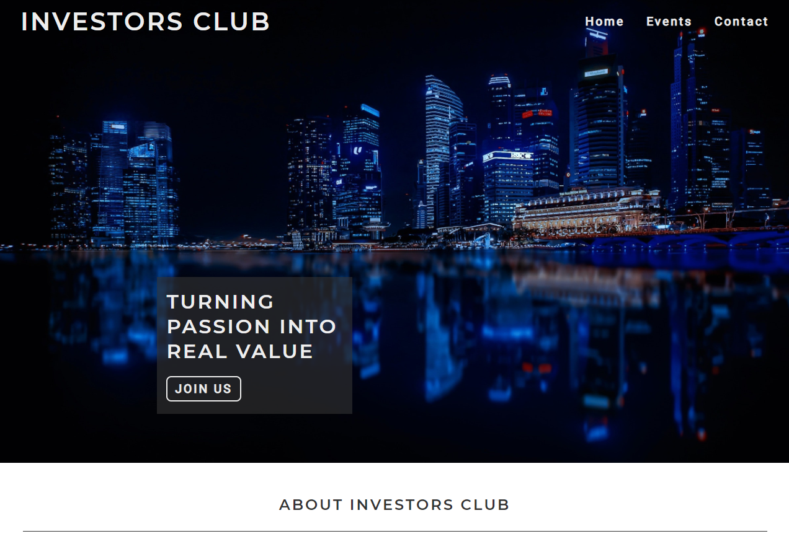

### About Section

- The about section serves as an introduction to the club and contains a summary of the why's and how's behind it. The text emphasize that everyone is welcome, regardless of previous experience in the investment-world. An image beside the text provides balance and helps the text fit better.  The font colour is the standard dark slate grey (#333333) against the white background. There is an added shadow to the image for a more inviting look.

- This section also offers responsiveness in that the image is moved below the text on smaller screen sizes. Both the image and the text is adjusted in size to fill an appropriate width as screen size shifts.

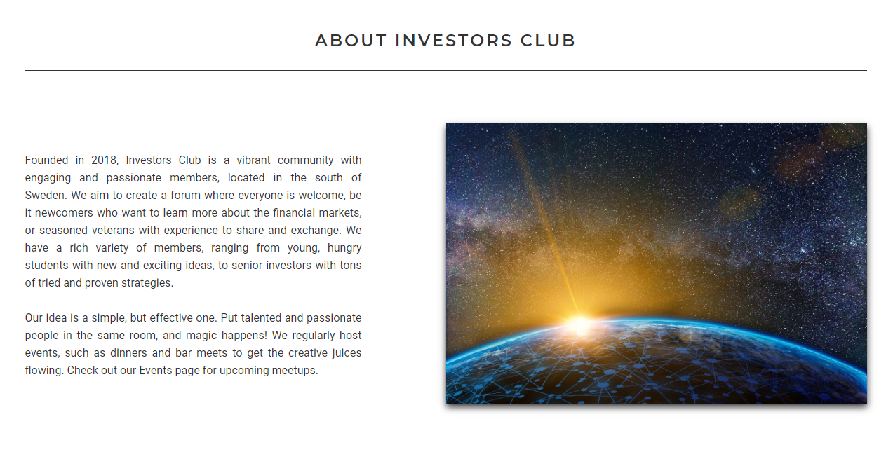

### Why Join Section

- The why join section consists of an image representing teamwork and a sense of community, and a text explaining the benefits of joining the club. The background is whitesmoke (#EEEEEE) to break off the white and add contrast between the sections. The shadow of the image above in the about section is duplicated.

- Just like the section above, the text and image is responsive and will follow the same adjustments as the about section for a clean and consistent design.

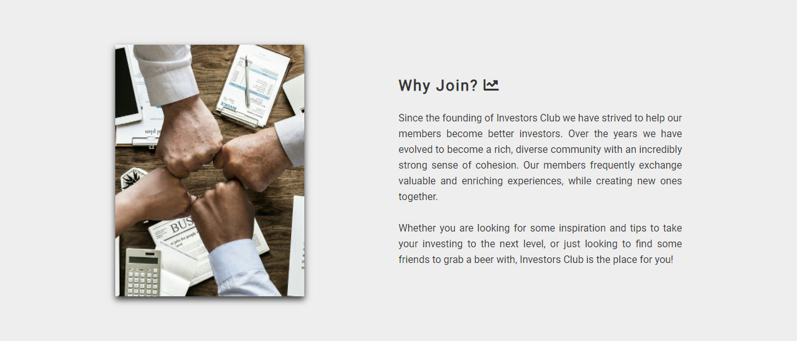

### Footer

- The footer includes a short copyrght text on the left hand side, and links to different social media plattforms on the right. Since Investors club is fictional the links directs the user to the homepage of each plattform respectively. They also open in a new tab, so the user isn't directed away from the site.

- On smaller screen sizes the links fit below the copyright text, and the font size is reduced, for better positioning.

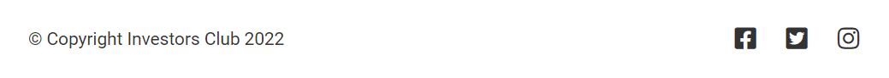

### Events Page

- The events page is a seperate page that is accessed from the nav bar. The nav bar at the top has been restyled with the standard colour of dark slate grey (#333333) to fit the white background. There are buttons below the nav bar for either 'Bar Meets' or 'Dinners' to jump to the corresponding events. Below the buttons are event cards, three for each category, which contain information about the event, such as date/time and location. The cards also contain an inviting image and a shadow has been added for extra depth.

- The cards will change from horizontal to vertical positioning on smaller screen sizes, which keeps the page easily navigated on mobile devices. The header and footer will follow the home pages responsiveness for a consistent look.

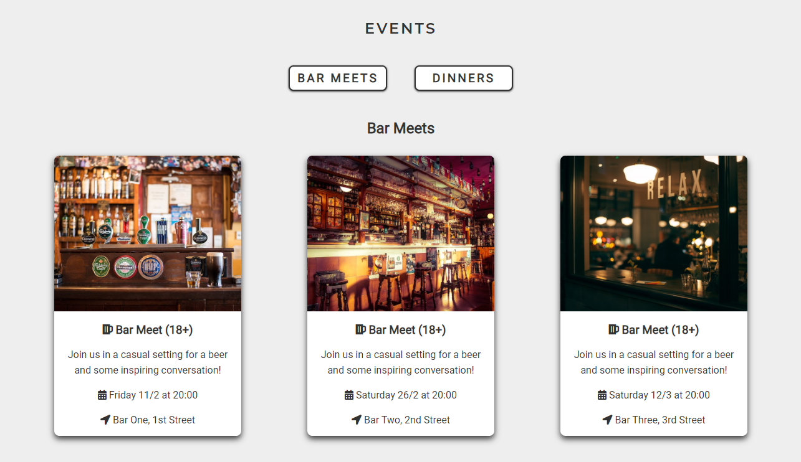
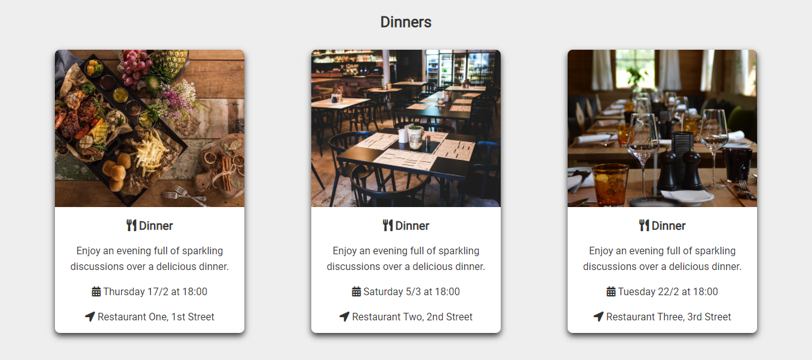

### Contact Page

- The contact page is another seperate page that is accessed from the nav bar, or by clicking the 'Join us' button on the landing page. A form is presented over a looping video of a skyscraper, where the user can sign up for upcoming events from a dropdown menu. Inputs for first name, last name and email are required for submission, while the events menu is optional, since there is also an optional textbox for questions or propositions for future events. A submitted form is confirmed with the Code Institute form dump.

- When viewed on smaller screen sizes, the contact page will adjust to maintain an appealing layout. The header and footer will behave the same as on the other pages.

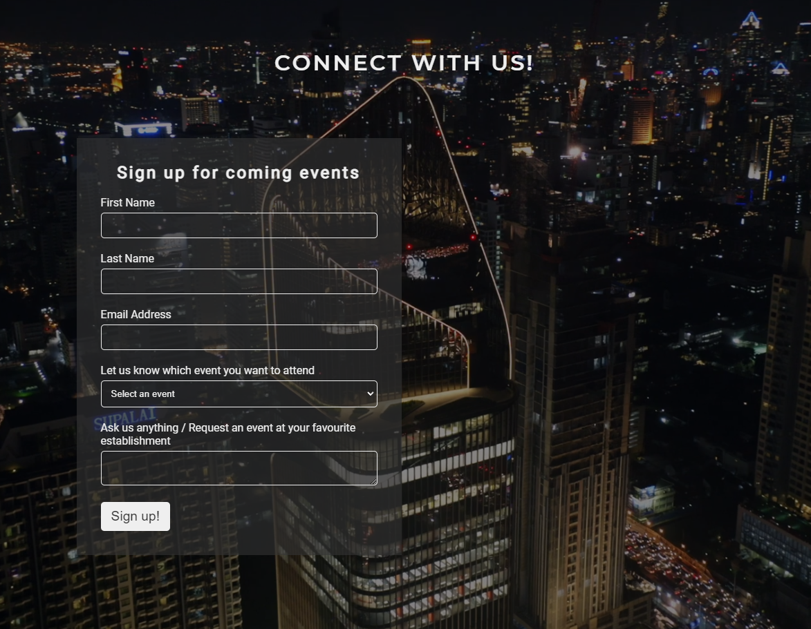

### 404 Error Page

- A 404 page will tell the user that a requested page is not available, due to an invalid url or a deleted or moved page. A clear message indicating an error is displayed, and the user is presented with a link back to the home page.

- The responsiveness is consistent with the other pages of the website.

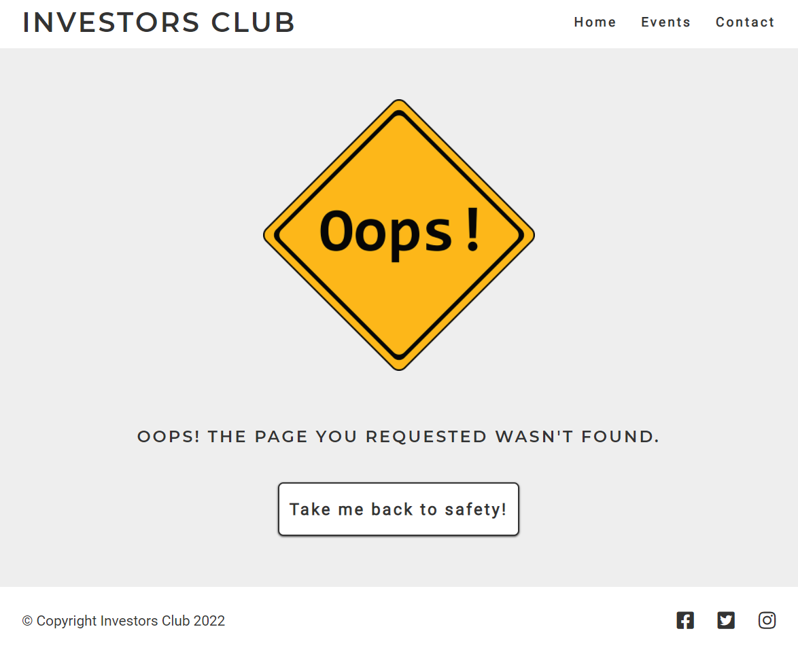

### Features Left to Implement

- A 'Members page' where users can become members and have login credentials.
- A forum within the members page where users can have conversations online.

## Testing
### Validator Testing

- To ensure that all HTML code of the website is correct, validation through the W3C Markup Validator was performed and no errors were found in the HTML pages. 
  - [W3C Markup Validator](https://validator.w3.org/) - [Home Page results](https://validator.w3.org/nu/?doc=https%3A%2F%2Flucasbehrendt.github.io%2Finvestorsclub%2Findex.html), [Events Page results](https://validator.w3.org/nu/?doc=https%3A%2F%2Flucasbehrendt.github.io%2Finvestorsclub%2Fevents.html), [Contact Page results](https://validator.w3.org/nu/?doc=https%3A%2F%2Flucasbehrendt.github.io%2Finvestorsclub%2Fcontact.html), [404 Error Page results](https://validator.w3.org/nu/?doc=https%3A%2F%2Flucasbehrendt.github.io%2Finvestorsclub%2F404.html)

- Validation of the CSS code was performed through the W3C CSS Validator. No errors were found in the process.
  - [W3C CSS Validator](https://jigsaw.w3.org/css-validator/) - [Results](https://jigsaw.w3.org/css-validator/validator?uri=https%3A%2F%2Flucasbehrendt.github.io%2Finvestorsclub%2Findex.html&profile=css3svg&usermedium=all&warning=1&vextwarning=&lang=sv)

### Responsive Testing

- You can open DevTools with keyboard shortcuts (CMD+Opt+I for Mac OS or Ctrl+Shift+I for Linux and Windows), through the menu bar in the top right corner and go to “More Tools” > “Developer Tools.” or by rightclicking on any web page and select "Inspect". To test responsiveness click on the "device" icon on the left side, above the source code window or with the keyboard shortcut CMD+Shift+M for Mac OS or Ctrl+Shift+M for Linux and Windows. Here you can choose between different devices to emulate, or you can drag the handles to resize the window to your preffered screen width.

- To test responsiveness the website was viewed on multiple different devices including a Desktop, Laptop, Ipad Air, Samsung Galaxy S20, Iphone 12, Iphone X, Iphone 8 and Iphone SE(2016). Mobile devices and tablets were viewed in both portrait and landscape mode. The site was also tested on different browsers, such as Chrome, Edge, Safari and Firefox.

- Using Chrome DevTools, the site was optimized for all screen widths down to 300px.

### Lighthouse Testing

- The Lighthouse tool in Chrome DevTools was used to test the sites performance, accessibility, best practices and SEO. All pages performed well in the tests, indicating a well-structured website that is highly accessible.

- [Home Page Lighthouse Report](https://googlechrome.github.io/lighthouse/viewer/?psiurl=https%3A%2F%2Flucasbehrendt.github.io%2Finvestorsclub%2Findex.html&strategy=desktop&category=performance&category=accessibility&category=best-practices&category=seo&category=pwa&utm_source=lh-chrome-ext)

- [Events Page Lighthouse Report](https://googlechrome.github.io/lighthouse/viewer/?psiurl=https%3A%2F%2Flucasbehrendt.github.io%2Finvestorsclub%2Fevents.html&strategy=desktop&category=performance&category=accessibility&category=best-practices&category=seo&category=pwa&utm_source=lh-chrome-ext)

- [Contact Page Lighthouse Report](https://googlechrome.github.io/lighthouse/viewer/?psiurl=https%3A%2F%2Flucasbehrendt.github.io%2Finvestorsclub%2Fcontact.html&strategy=desktop&category=performance&category=accessibility&category=best-practices&category=seo&category=pwa&utm_source=lh-chrome-ext)

- [404 Error Page Lighthouse Report](https://googlechrome.github.io/lighthouse/viewer/?psiurl=https%3A%2F%2Flucasbehrendt.github.io%2Finvestorsclub%2F404.html&strategy=desktop&category=performance&category=accessibility&category=best-practices&category=seo&category=pwa&utm_source=lh-chrome-ext)

### Links and Form Testing

- All navigational links were tested to ensure that the correct target is reached. This includes the logo, menu links, the "Join us" button, the buttons on the events page and the "back to safety" button on the 404 page.

- The hover function implemented for the links and buttons works as expected.

- The social media icons in the footer of each page were tested to make sure they open in a new tab and have the correct target.

- The form on the contact page was tested to ensure that the required input fields (first and last name, email) could not be omitted and that the correct data was sent to the formdump.

### Fixed Bugs

- When viewing the website on mobile devices the contact page form and "connect with us" title was out of position and overlapping the nav bar. By changing the positional values from the top of the page from percentual to absolute, the issue was resolved and the elements now stay in the correct position on all devices.

- The "about investors club" section did not fit the design of the site and was not pleasing to read. By adding an image and tying the "about" and "why join" sections together, the flow of the page improved on both desktop and mobile devices.

- The submit button on the contact form did not recieve the correct style rules on IOS devices. This was a fairly common issue and the solution could be found quite easy on Stackoverflow. The rules -webkit-appearance: none; / -moz-appearance: none; / appearance: none; was added to force the styling to take effect on IOS.

### Known/Unfixed Bugs

- Smooth scrollbehaviour does not work on mobile devices.

- On certain mobile devices there are narrow white bars on the sides in landscape mode.

## Technologies Used
### Languages

- [HTML5](https://en.wikipedia.org/wiki/HTML5)

- [CSS3](https://en.wikipedia.org/wiki/CSS)

### Programs & Libraries

- [Am I Responsive](http://ami.responsivedesign.is/) - The responsive image at the top of the README came from Am I Responsive.

- [Balsamiq](https://balsamiq.com/) - The wireframes used for the site was created whith Balsamiq.

- [Chrome DevTools](https://developer.chrome.com/docs/devtools/) - A powerful tool used throughout the creation of the website.

- [Favicon](https://favicon.io/) - The favicon visible in the websites tab was taken from here.

- [Font Awesome](https://fontawesome.com/) - All icons in the site was provided by Font Awesome.

- [Git](https://git-scm.com/) - Git was used through the Gitpod terminal to commit to Git and push to Github.

- [Github](https://github.com/) - All code for the site is stored on Github after being pushed fom Git. Github Pages served as host for the site.

- [Google Fonts](https://fonts.google.com/) - The fonts used on the site was imported from Google Fonts.

- [Pixabay](https://pixabay.com/) - All images and the contact page video was provided by Pixabay.

- [W3C](https://www.w3.org/) - Validation of HTML and CSS code was done with W3C.

- [WebAIM](https://webaim.org/) - Used for accessibility verification.

## Deployment
### Github Pages

The website was deployed using GitHub Pages. The steps for the deployment process are:

1. Log in to your GitHub account.

2. On the left side of the screen, choose the repository you wish to deploy.

3. At the top of the repository, select "settings".

4. In the navigation bar to the left, click the "Pages" section.

5. Under 'Source', select the 'Main' branch and click 'Save'.

6. The site should be live in a few minutes, indicated by a green background with the words " Your site is published at (live address)"

The live link can be found here - [Investors Club](https://lucasbehrendt.github.io/investorsclub/)

### Cloning

The repositoty for the website can be cloned to a local machine. The cloning procedure pulls down a full copy of all the data on GitHub.com at that time. The steps required for the clone are:

1. Navigate to the main page of the repository you wish to clone.

2. Above the list of files, click the "code" button.

3. To clone the repository using HTTPS, under "clone with HTTPS", copy the URL provided.

4. Open Git Bash.

5. Change the current working directory to the location where you want the cloned directory.

6. Type `git clone`, and then paste the URL you copied earlier.
     ```
    $ git clone https://github.com/YOUR-USERNAME/YOUR-REPOSITORY`
    ```
7. Press Enter to create your local clone.
    ```
    $ git clone https://github.com/YOUR-USERNAME/YOUR-REPOSITORY
    > Cloning into `Clone-dir`...
    > remote: Counting objects: 10, done.
    > remote: Compressing objects: 100% (8/8), done.
    > remove: Total 10 (delta 1), reused 10 (delta 1)
    > Unpacking objects: 100% (10/10), done.
    ```
For a more detailed explanation, see this [walkthrough](https://docs.github.com/en/repositories/creating-and-managing-repositories/cloning-a-repository).

## Credits
### Code

- [Stackoverflow](https://stackoverflow.com/) helped me tackle some positioning issues and gave me new ideas how to solve them. 

- [W3Schools](https://www.w3schools.com/) also helped me and inspired me to try new things.

- [MDN Web Docs](https://developer.mozilla.org/en-US/) was a great source of CSS coding issues.

- The Code Institute Love Running project provided inspiration mainly for the form used in the contact page.

### Content

- Fonts imported from [Google Fonts](https://fonts.google.com/).

- All text content was written by the developer.

### Media

- Icons used in the site were taken from [Font Awesome](https://fontawesome.com/).

- The favicon was taken fron [Favicon.io](https://favicon.io/) and is credited in the code, with a link to the source.

- All image and video elements were provided by [Pixabay](https://pixabay.com/). The sources for each image/video is credited in the code, with links to the source.

### Acknowledgements

- My mentor Brian for some great feedback along the way, and some good ideas on how to make the project better.

- Family and friends, who provided both valuable feedback and praise!